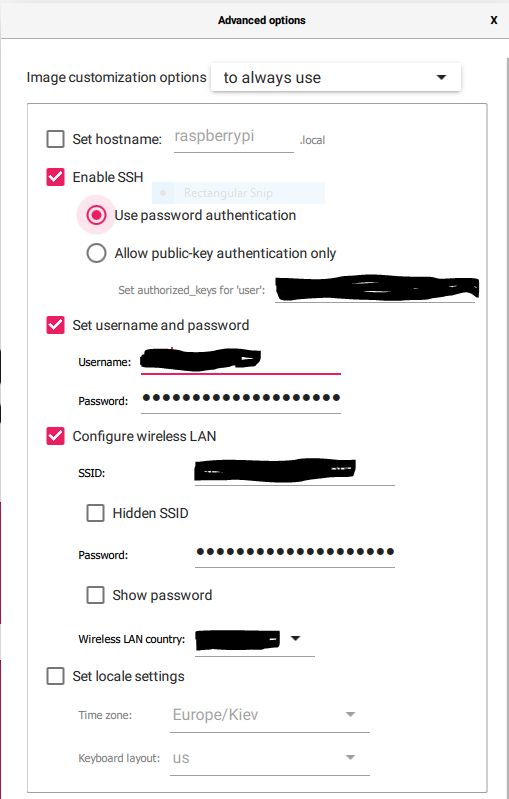
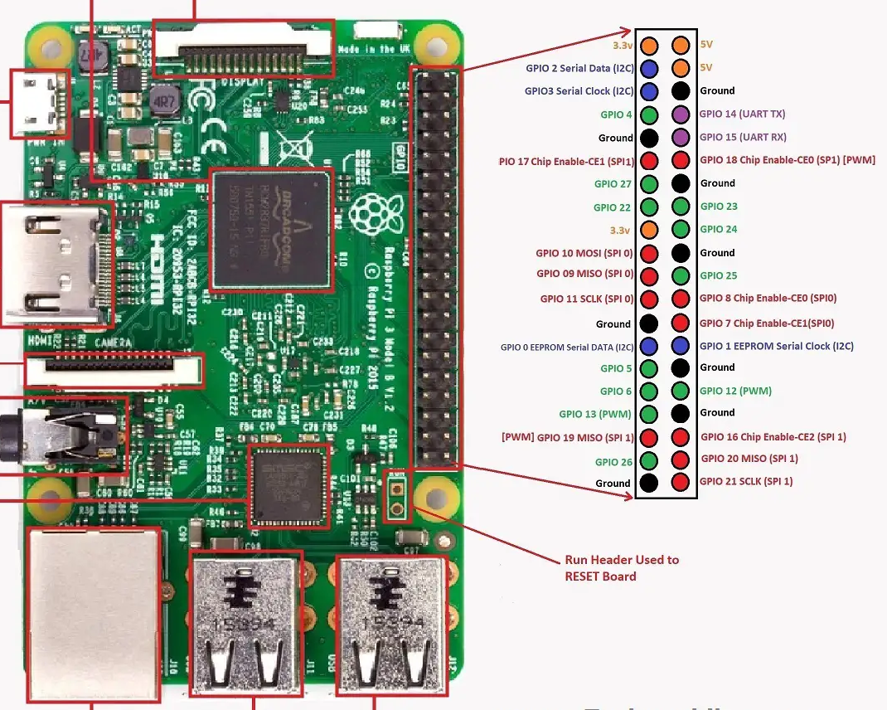

ESP32, ESP-IDF, RaspberryPi and OpenOCD
=

This instruction is based on info found in free access on web and describes
setting up dev and debug setup on RaspberryPi 3B using ESP-IDF, OpenOCD, and RaspberryPi GPIOS as debug interfaces. 

Setup RaspberryPi OS (64-bit)
-
Nothing special, just flash a micro SD card and insert it in your Raspberry Pi.
It is useful to use RaspberryPi Imager, which allows preset new user, enable sshd by default and setup WIFI.

It also might be handy to enable USART as a fallback method to connect.
Just add lines int the end of config.txt

	# Enable UART
	enable_uart=1

Setup ESP-IDF
-
ESPRESSIF has good enough documentation. Just follow the instructions: [Standard Toolchain Setup for Linux and macOS](https://docs.espressif.com/projects/esp-idf/en/v5.1.1/esp32/get-started/linux-macos-setup.html).
The only recommendation: do not add permanently exporting environment by adding it into your `.bashrc`.
Instead, add alias:

	alias get_idf=". $HOME/esp/esp-idf/export.sh ; PS1=\"(ESP-IDF)$PS1\""

Setup OpenOCD
-
Thanks to Uri Shaked, we easily can use his instructions to setup jtag debug by bare pins on RaspberryPi.
[ESP32 JTAG Debugging using Raspberry Pi](https://blog.wokwi.com/gdb-debugging-esp32-using-raspberry-pi/).

Notes:
- using `bcm2835gpio_jtag_nums 11 25 10 9` is deprecated, instead use:
	- `adapter gpio tck 11`
	- `adapter gpio tms 8`
	- `adapter gpio tdi 10`
	- `adapter gpio tdo 9`
- due to changing `tms` from `25` to `8`, wiring will be slightly different. Check pinout.

- `adapter_khz` is deprecated, use `adapter speed`
- better to not install openocd globally
- in case you fail to halt the target via the openocd, here is a workaround:
	- `. $HOME/esp/esp-idf/export.sh ; esptool.py --port=/dev/ttyUSB0 --chip esp32 erase_flash ; sudo OPENOCD_SCRIPTS=$path/tcl $path/src/openocd -f interface/raspberrypi2-native.cfg -f target/esp32.cfg -c "adapter speed 1000" -c 'program_esp <path_to>/bootloader.bin 0x1000 verify' -c 'program_esp <path_to>/<your_target_firmware>.bin 0x10000 verify' -c 'program_esp <path_to>/partition-table.bin 0x8000 verify' `

